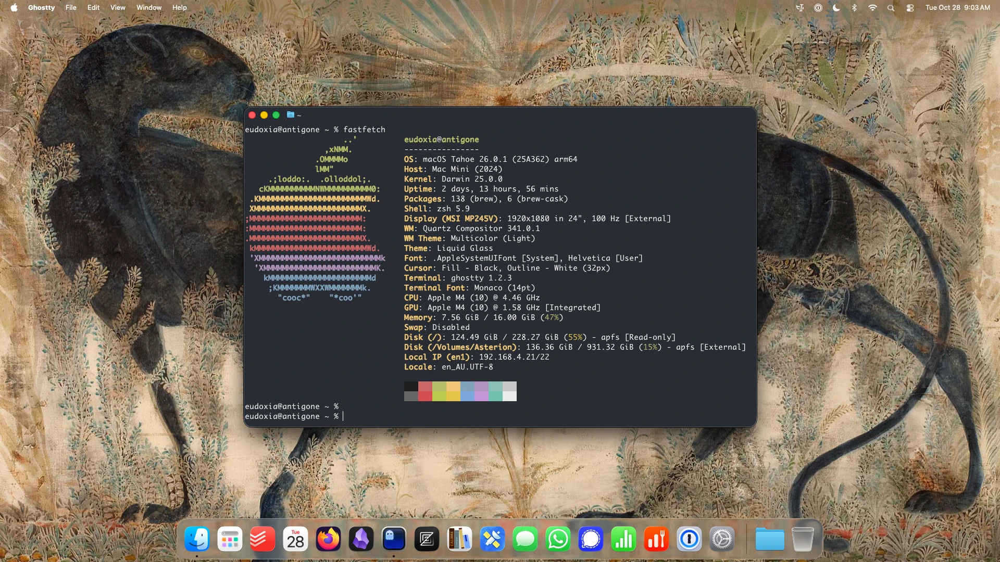

# eudoxia's dotfiles

My dotfiles repository.

## Boxen

Screenshots and information about the various hosts.

### [Antigone](https://github.com/eudoxia0/dotfiles/tree/master/hosts/antigone)

- **Hardware:** [2024 Mac mini](https://support.apple.com/en-au/121555)
- **Package Manager:** [Homebrew](https://brew.sh/)
- **Window Manager:** [AeroSpace](https://github.com/nikitabobko/AeroSpace)
- **Text Shortcuts:** [Espanso](https://espanso.org/)
- **Terminal:** [ghostty](https://ghostty.org/)
- **dotfiles management:** [make](https://github.com/eudoxia0/dotfiles/blob/master/hosts/antigone/Makefile)

### [Rostam](https://github.com/eudoxia0/dotfiles/tree/master/hosts/rostam)

- **Hardware:** misc.
- **Package Manager:** [Nix](https://nixos.org/)
- **Window Manager:** [stumpwm](https://stumpwm.github.io/), [Sway](https://swaywm.org/)
- **Text Shortcuts:** [Espanso](https://espanso.org/)
- **Terminal:** [alacritty](https://github.com/alacritty/alacritty)
- **dotfiles management:** [make](https://github.com/eudoxia0/dotfiles/blob/master/hosts/rostam/Makefile)
