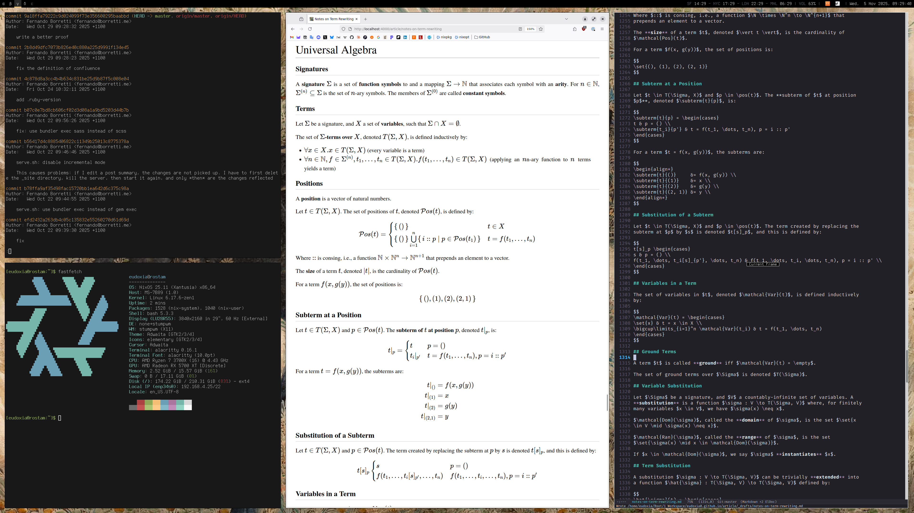
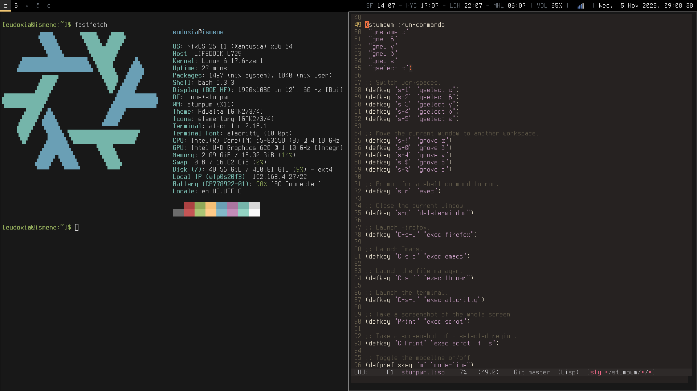

# eudoxia's dotfiles

My dotfiles repository.

## Boxen

Screenshots and information about the various hosts.

### [Rostam](https://github.com/eudoxia0/dotfiles/tree/master/hosts/rostam)

- **Hardware:** misc.

### [Ismene](https://github.com/eudoxia0/dotfiles/tree/master/hosts/ismene)

- **Hardware:** [Fujitsu Lifebook U729](https://www.fujitsu.com/my/products/computing/pc/ap/notebooks/lifebook-u729/)

## Stack

- **Configuration Manager:** [home-manager](https://github.com/nix-community/home-manager)
- **Distro:** [NixOS](https://en.wikipedia.org/wiki/NixOS)
- **Editor:** [GNU Emacs](https://www.gnu.org/software/emacs/)
- **File Manager:** [Thunar](https://en.wikipedia.org/wiki/Thunar)
- **Package Manager:** [Nix](https://nixos.org/)
- **Password Manager:** [1Password](https://1password.com/)
- **Shell:** [nushell](https://www.nushell.sh/)
- **Status Bar:** [polybar](https://github.com/polybar/polybar)
- **Terminal:** [alacritty](https://github.com/alacritty/alacritty)
- **Text Shortcuts:** [Espanso](https://espanso.org/)
- **Web Browser:** [Firefox](https://www.firefox.com/en-US/)
- **Window Manager:** [stumpwm](https://stumpwm.github.io/)

## License

© 2013-2025 by [Fernando Borretti][fb]. Licensed under the MIT license.

[fb]: https://borretti.me/
